# Jess Lee T1A3 Terminal App Assignment

## GitHub Repository

Here is my GitHub repo I have used during the duration of this project:

https://github.com/jayel888/t1a3-terminal-app

# Restaurant Tracker App

Welcome to my Restaurant Tracker Terminal Application! The purpose of this application is for users to create their own little library of restaurants which holds information such as contact details, price per head and personal ratings about restaurants they have visited or intend to visit. It allows people to add/remove restaurants and filter by certain metrics, or randomly generate a restaurant, which can be handy if you can't decide where to eat! This can be helpful to people who want to note their restaurant experiences to remember if they want to go there again or not.

My application has been designed to utilise multiple programming concepts such as variables, user inputs, conditional loops and error handling for each function. Please see below for in-depth descriptions of each feature and my logical reasoning behind the code. 

## Table of Contents
- [Features of Application and Reasoning](#features-of-the-restaurant-tracker-and-logical-reasoning)
    -[Menu](#menu)
    -[Display All Restaurants](#display-all-restaurants-from-data)
    -[Add a Restaurant](#add-a-restaurant)
    -[Remove a Restaurant](#remove-a-restaurant)
    -[Filter Restaurants](#filter-restaurants-in-dataset-by-price-or-rating)
    -[Generate a random Restaurant](#generate-random-restaurant-based-on-price)
    -[Read and Save Data](#read-and-save-data)
-[Instructions](#instructions---how-to-use-application)

## Features of the Restaurant Tracker and Logical Reasoning

### Menu

Upon opening the app, you will be greeted with the menu prompting the user to choose from the list above. After completing each feature, you will return to this menu until number 6 is selected which will save all updates/changes made and exit the program. 

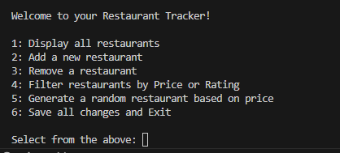

### Display all Restaurants from data

The first feature I developed for this app is to simply display all restaurants stored in the dataset. I have utilised the Pandas package for my application, as it provides a aesthetic way of displaying keys and values in a table, rather than having the same information repeated every line per set of data. 

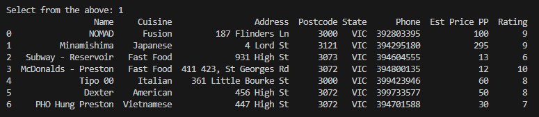

As I have imported Pandas, I assigned the variable 'df' for dataframe, to import my .json file and read its data, and printed it to output all the restaurants as shown in image above. It is a simple but effective function. I have attempted error handling for KeyError's if a key is called that isn't in the data set, and an exception to print out any other errors that may occur. 

### Add a Restaurant 

The next feature I developed was to add restaurants to the data set, so you can build your library. This is the longest function developed as it prompts the user for multiple inputs, for each key of data. The first prompt asks the user to enter the name of the Restaurant. I have used a `while` loop for each input in this function to re-prompt the user if an invalid input is received. In this case, if the only requirement is that it cannot be left blank.

It next asks user for the type of cuisine of the restaurant. In this code, I have programmed it so that it will search the string for any digits or special characters in the users input, and re-enter the loop if there are any. I chose to do it this way as cuisine's should just be alphabetical, ie. Japanese, Italian, Fusion, etc. 

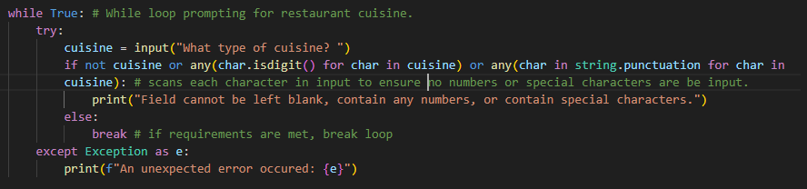

Once conditions are met for cuisine, it prompts users to enter the address of the restaurant without any state or postcode. The only condition for this is that it can't be left blank.

Next it prompts for the postcode. I have programmed it so that all inputs must be completely numeric and exactly 4 digits long, for all Australian postcodes. Based on the valid input provided, I have used an `if, elif, else` statement to automatically assign the state. eg, if the input postcode starts with 3, the state will be VIC, else if it doesn't meet any standard Australian postcode start digits, it will prompt user to enter the state manually. 

After the address details have been completed, it prompts users for the phone number. This has been designed to check the input is only numerical as well as being exactly 8 or 10 digits long. Anything outside the conditions will re-prompt the user to enter a valid phone number. I had it set to 8 or 10 digits so that landline numbers can be entered without the area code, and 10 digits for mobile and landline including area code. If the phone number is unknown, the user can enter 'NA' in either upper or lowercase to move onto the price.

The price is prompted and has been setup to automatically turn the input into an integer. As it's an integer, I have used error handling for ValueErrors, so that it can only be numbers and above $0. 

Finally it will prompt for the users personal rating of the restaurant. I have input a specific range of 0-10, and anything outside this range will re-enter the while loop. Again, Error Handling has been implemented as only an integer will be accepted, so anything else will give an error message. 

Once all fields have been successfully entered, it will show a message and return user to the main menu

### Remove a Restaurant

This function was created to remove restaurants from your library. Additionally, as once the 'Add Restaurant' function is called, it can't be exited from unless closing the program. So this is a method users can utilise to remove if they have entered anything incorrectly initially, without having to close the app entirely.

For this function, I used a `for` loop and `if` to search all restaurants the key "Name" and match its value exactly to the users input. I used the `lower` method so that it can still match even if the user doesn't have to input capitals if they don't want, optimising user experience. If there is a match, it will remove it and update the dataset. If there are no matches, it will inform that no restaurants found and return user to the start menu. 

### Filter restaurants in dataset by price or rating

I designed a feature that allows users to filter all restaurants in the dataset by 'Price' or 'Rating', so users can narrow down a list for them to choose from. The strip() and lower() method has been implemented to give some room for error in the input. 

If price is entered, it will prompt the user to enter a maximum price threshold. The input cannot be negative value or it will return an error message. One a valid input has been received, the code will output all restaurants that are equal to or less than the value. In the example below, the threshold has been set to $50 and shows all restaurants with their index number equal to, or below that. 

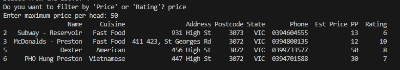

If rating has been entered, the user must enter a number between 0-10. The application will then output all restaurants with a rating equal to or **higher** than the users input. The purpose for this is primarily to be able to show what restaurants are good so you have a better selection pool deciding where you want to eat. The utilises Panda to output the information in a table. 

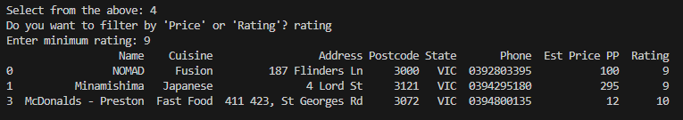

### Generate random restaurant based on price

This feature outputs one single restaurant with a price limit set by the user. It utilises the "random" package from Python. This has again been programmed with a `while` loop, and once entered, will prompt user for a price threshold. I have coded it so that users may also enter 'any' if there is no limit. If a number is entered, it converts the string into an integer and uses the `random.choice` method to store one restaurants data into a variable. The variable is then printed using Pandas without an index number. If there are no restaurants within the price limit, users will receive a message informing so. 

### Read and Save data

To access the .json file, I have imported the 'json' in-built python package and crated two separate functions. the `import_restaurants_list` function uses `json.load` method to read the data, while the `save_restaurants_list` uses `json.dump` method to write and append the data file. 

When selecting 6 from the main menu, it will save all updates/changes made in the session and exit the application. 

## Instructions - How to use application
To launch application, enter `./run.sh` from JessLee_T1A3 folder.
A virtual environment will be created and activated, and external packages installed within.
Once the application has loaded, you will be greeted with the Main Menu screen. The app has been pre-loaded with a 7 different restaurants to explore it's features, but they can be removed.

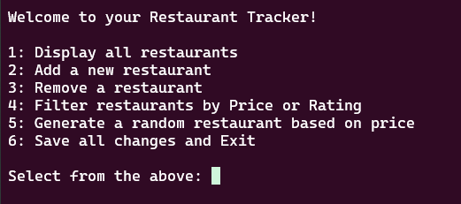

You will need to enter a number from 1 - 6 depending on what you would like to do within the app.

### 1. Display all restaurants 
Will Display all the restaurants that are already loaded into the application. This will display information such as the restaurant name, type of cuisine, the address, phone number, price per head and your rating in an easy to read table format. 

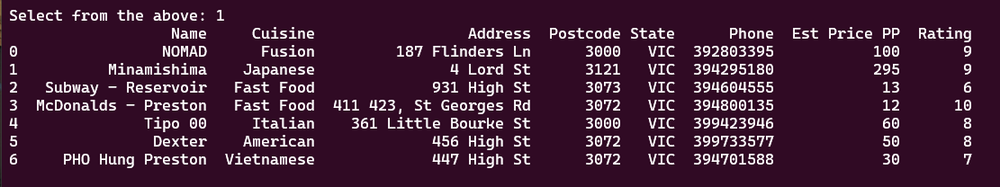

### 2. Add a new restaurant

Select this to add a new restaurant to your list. You will be prompted for information about the restaurant and any invalid inputs will ask you to enter something again. Once all the information has been entered, you should receive a message that saying "Restaurant Successfully added!" and then redirected back to the menu. 

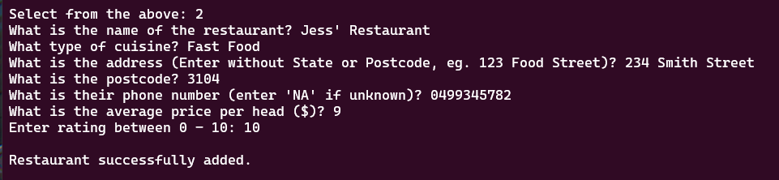

Once at the menu, you can select 1 to see the latest entry in the list.

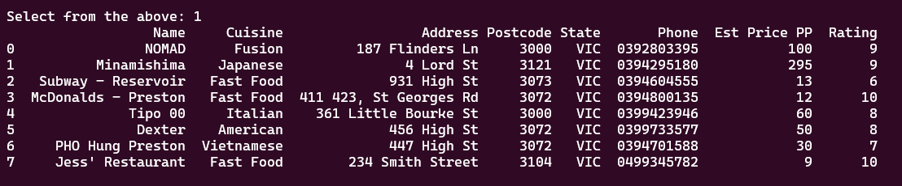

### 3. Remove a restaurant
Select this to remove a restaurant from the list of data. If you have made any mistakes when adding a restaurant, as you cannot edit already completed entries, you will need to delete it entirely and re-add it. When deleting a restaurant, you will need to enter it exactly how it is displayed in 'Display all restaurants' table. However upper or lowercase characters will still work if spelled correctly. See example below. You will receive a prompt informing whether or not your input has matched. Once returned to the main menu, you can press 1 to confirm the entry has been deleted.

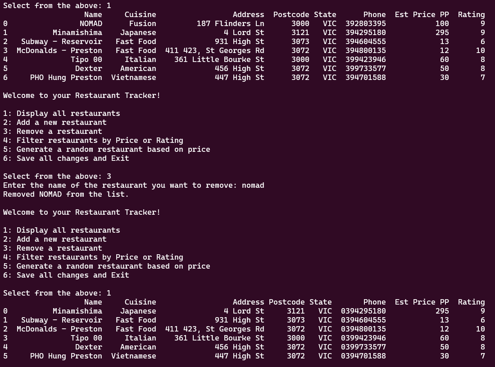

### 4. Filter Restaurants

This feature lets you filter restaurants either by 'Price' or 'Rating'. 

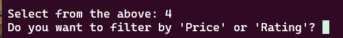

If you select 'Price', you will then be prompted to enter a price limit. If you input anything other than a positive number, it will take you back to the start. If a valid number is provided, the program will display all restaurants **equal to and below** that price per head limit. 

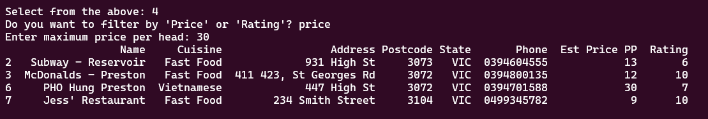

If 'Rating' is selected, similar to price, you will be prompted to enter a number between 0-10. If a valid number is provided, the program will display all restaurants with a rating **equal to or below** the input. 

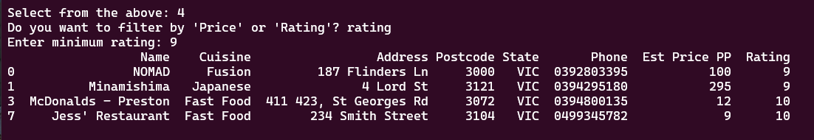

Once completed, you will be returned to the main menu.

### 5. Generate a random restaurant

This allows you to set a price limit and the program will generate one single restaurant **equal to or below** the price provided. This is super handy if you want someone to decide where you should eat!

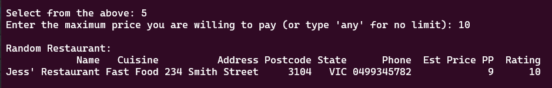

### 6. Save and Exit
If selected, the application will save all updates/changes made in the session and close the application. When you re-open the application, you will see your changes have been saved.